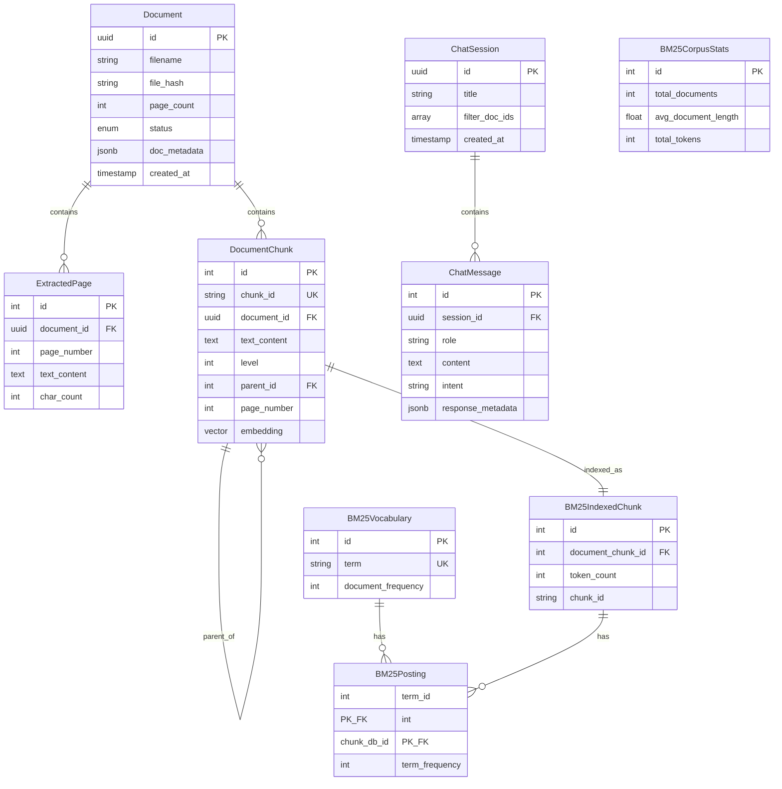
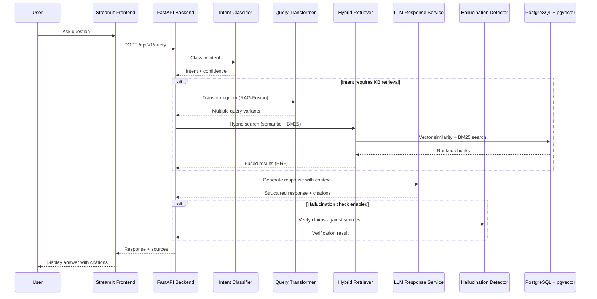
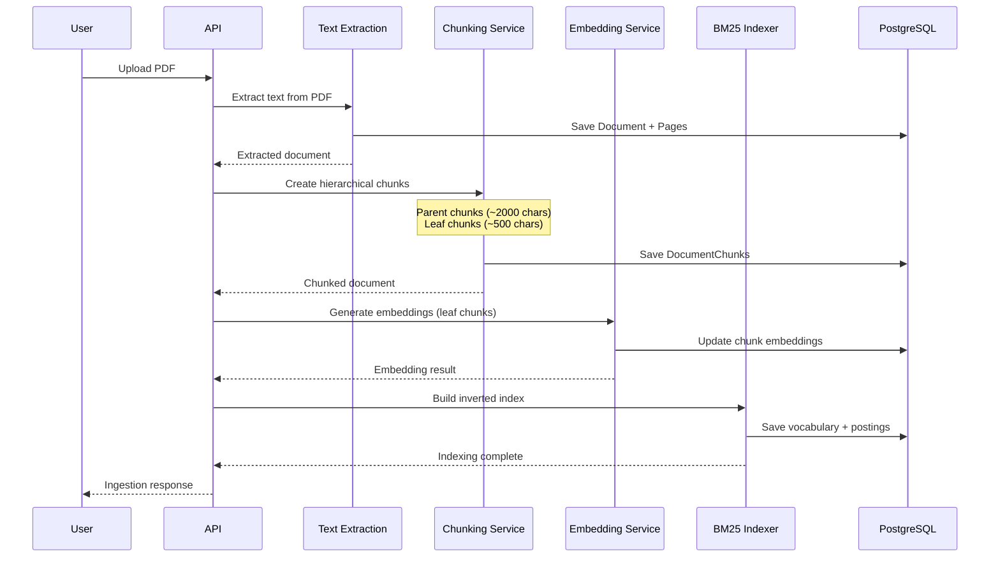

# RAG Knowledge Base

A Retrieval-Augmented Generation (RAG) system that enables conversational AI over your PDF documents with citation tracking, intent-aware responses, and hallucination detection.

## Table of Contents

- [Overview](#overview)
- [Quick Start](#quick-start)
- [Usage](#usage)
- [Configuration](#configuration)
- [Data Model](#data-model)
- [Architecture](#architecture)
- [API Reference](#api-reference)
- [Features](#features)
- [Limitations](#limitations)
- [FAQ / Troubleshooting](#faq--troubleshooting)
- [Acknowledgments](#acknowledgments)

---

## Overview

This project provides an end-to-end RAG pipeline for building knowledge base chatbots that can:

- **Ingest PDF documents** and extract text with hierarchical chunking
- **Answer questions** using hybrid search (semantic + BM25 keyword matching)
- **Classify intents** to provide structured, context-appropriate responses
- **Detect hallucinations** and block responses with unsupported claims
- **Track citations** back to source documents and pages

### Design Choices

1. **"Retrieve Small, Read Big"** - Chunking strategy uses small chunks for precise retrieval but expands to parent chunks for richer LLM context
2. **RAG-Fusion** - Generates multiple query variants and fuses results using Reciprocal Rank Fusion (RRF)
3. **Hybrid Search** - Combines semantic embeddings (pgvector) with BM25 keyword search for robust retrieval
4. **Intent-Aware Responses** - Classifies queries into 10+ intents and generates structured responses per intent type
5. **Post-hoc Hallucination Detection** - Verifies claims against source documents before returning responses

---

## Quick Start

### Prerequisites

- Python 3.13+
- PostgreSQL with [pgvector extension](https://github.com/pgvector/pgvector)
- [Mistral AI API key](https://console.mistral.ai/)
- [uv](https://docs.astral.sh/uv/) package manager (recommended)

### Installation

```bash
# Clone the repository
git clone https://github.com/startificial/johnmiller_stackai
cd johnmiller_stackai

# Install dependencies with uv
uv sync
uv sync --group dev       # For development dependencies
uv sync --extra frontend  # For Streamlit frontend
```

### Local Environment Setup

Create a `.env` file in the project root:

```env
# Required
MISTRAL_API_KEY=your_mistral_api_key_here

# PostgreSQL Database Settings
POSTGRES_HOST=localhost
POSTGRES_PORT=5432
POSTGRES_USER=rag_user
POSTGRES_PASSWORD=rag_password
POSTGRES_DB=rag_db
```

### Database Setup

```bash
# Pre-Reqs: Ensure PostgreSQL is installed and available on the current path. Ensure the pgvector extension is installed. 
# Ensure PostgreSQL is running with pgvector extension
# Create the database and user
createdb rag_db
psql -d rag_db -c 'CREATE EXTENSION IF NOT EXISTS vector;'
```

### Running the Application

```bash
# Start the FastAPI backend
cd backend
uvicorn app.main:app --reload --host 0.0.0.0 --port 8000

# In a separate terminal, start the Streamlit frontend
streamlit run frontend/app.py
```

Access the application:
- **Backend API**: http://localhost:8000
- **API Documentation**: http://localhost:8000/docs
- **Frontend UI**: http://localhost:8501

---

## Usage

### Uploading Documents

```python
import httpx

# Upload a PDF document
with open("document.pdf", "rb") as f:
    response = httpx.post(
        "http://localhost:8000/api/v1/ingest",
        files={"files": ("document.pdf", f, "application/pdf")}
    )
print(response.json())
```

### Querying the Knowledge Base

```python
# Simple query
response = httpx.post(
    "http://localhost:8000/api/v1/query",
    json={"query": "How do I reset my password?"}
)
result = response.json()
print(f"Intent: {result['intent']}")
print(f"Response: {result['response']}")
print(f"Sources: {result['sources']}")
```

### Chat Sessions with History

```python
# Create a session
session = httpx.post(
    "http://localhost:8000/api/v1/chat/sessions",
    json={"title": "Password Help"}
).json()

# Send messages in the session
response = httpx.post(
    f"http://localhost:8000/api/v1/chat/sessions/{session['id']}/messages",
    json={"content": "How do I reset my password?"}
)
print(response.json())
```

---

## Configuration

All configuration is centralized in `backend/app/settings.py` and can be overridden via environment variables.

| Variable | Default | Description |
|----------|---------|-------------|
| `MISTRAL_API_KEY` | (required) | Mistral AI API key |
| `POSTGRES_HOST` | `localhost` | PostgreSQL host |
| `POSTGRES_PORT` | `5432` | PostgreSQL port |
| `POSTGRES_USER` | `rag_user` | PostgreSQL username |
| `POSTGRES_PASSWORD` | `rag_password` | PostgreSQL password |
| `POSTGRES_DB` | `rag_db` | PostgreSQL database name |
| `CHUNKING_PARENT_SIZE` | `2000` | Parent chunk target size (chars) |
| `CHUNKING_CHILD_SIZE` | `500` | Leaf chunk target size (chars) |
| `CHUNKING_OVERLAP` | `50` | Overlap between chunks (chars) |
| `EMBEDDING_MODEL` | `mistral-embed` | Embedding model (1024 dimensions) |
| `EMBEDDING_BATCH_SIZE` | `32` | Batch size for embedding API calls |
| `SEARCH_BM25_K1` | `1.5` | BM25 term frequency saturation |
| `SEARCH_BM25_B` | `0.75` | BM25 document length normalization |
| `RETRIEVER_RRF_K` | `60` | RRF constant for result fusion |
| `RETRIEVER_SEMANTIC_WEIGHT` | `1.0` | Weight for semantic search |
| `RETRIEVER_KEYWORD_WEIGHT` | `1.0` | Weight for BM25 search |
| `LLM_RESPONSE_MODEL` | `mistral-large-latest` | Model for response generation |
| `LLM_RESPONSE_MAX_TOKENS` | `2048` | Max tokens for responses |
| `LLM_RESPONSE_MIN_RELEVANCE` | `0.2` | Minimum relevance score threshold |
| `INTENT_MODEL` | `ministral-3b-latest` | Model for intent classification |
| `HALLUCINATION_MODEL` | `ministral-3b-latest` | Model for hallucination detection |
| `HALLUCINATION_THRESHOLD` | `0.5` | Block if >50% claims unsupported |
| `HALLUCINATION_CHECK_ENABLED` | `true` | Enable hallucination checking |
| `DEBUG` | `false` | Enable debug mode |

---

## Data Model



---

## Architecture

### System Overview



### Document Ingestion Pipeline



### Core Services

| Service | Purpose | Model Used |
|---------|---------|------------|
| **Text Extraction** | PDF text extraction using PyMuPDF | - |
| **Chunking** | Hierarchical chunking with parent/child structure | - |
| **Embedding** | Generate 1024-dim vectors | `mistral-embed` |
| **BM25 Indexer** | Build inverted index for keyword search | - |
| **Query Transformer** | Generate query variants (RAG-Fusion) | `mistral-small-latest` |
| **Hybrid Retriever** | Semantic + BM25 search with RRF fusion | - |
| **Intent Classifier** | Classify query intent (10 categories) | `ministral-3b-latest` |
| **LLM Response** | Generate intent-aware structured responses | `mistral-large-latest` |
| **Hallucination Detector** | Verify claims against sources | `ministral-3b-latest` |
| **Policy Repository** | Sensitive data request filtering | - |

---

## API Reference

### Ingestion

| Method | Endpoint | Description |
|--------|----------|-------------|
| `POST` | `/api/v1/ingest` | Upload PDF files for ingestion |
| `GET` | `/api/v1/documents` | List all documents with pagination |

### Query

| Method | Endpoint | Description |
|--------|----------|-------------|
| `POST` | `/api/v1/query` | Query the knowledge base |

### Chat Sessions

| Method | Endpoint | Description |
|--------|----------|-------------|
| `POST` | `/api/v1/chat/sessions` | Create a new chat session |
| `GET` | `/api/v1/chat/sessions` | List all sessions |
| `GET` | `/api/v1/chat/sessions/{id}` | Get session details |
| `PATCH` | `/api/v1/chat/sessions/{id}` | Update session |
| `DELETE` | `/api/v1/chat/sessions/{id}` | Delete session |

### Chat Messages

| Method | Endpoint | Description |
|--------|----------|-------------|
| `POST` | `/api/v1/chat/sessions/{id}/messages` | Send message and get response |
| `GET` | `/api/v1/chat/sessions/{id}/messages` | Get chat history |
| `GET` | `/api/v1/chat/sessions/{id}/export` | Export session (JSON/Markdown) |

### Health

| Method | Endpoint | Description |
|--------|----------|-------------|
| `GET` | `/` | Root endpoint |
| `GET` | `/health` | Health check |

<details>
<summary><strong>Request/Response Examples</strong></summary>

#### Ingest Documents

```bash
curl -X POST http://localhost:8000/api/v1/ingest \
  -F "files=@document.pdf"
```

Response:
```json
{
  "documents": [
    {
      "document_id": "550e8400-e29b-41d4-a716-446655440000",
      "filename": "document.pdf",
      "status": "completed",
      "page_count": 10,
      "chunks_created": 45,
      "chunks_embedded": 45
    }
  ],
  "errors": [],
  "total_files": 1,
  "successful": 1,
  "failed": 0
}
```

#### Query Knowledge Base

```bash
curl -X POST http://localhost:8000/api/v1/query \
  -H "Content-Type: application/json" \
  -d '{"query": "How do I reset my password?"}'
```

Response:
```json
{
  "query": "How do I reset my password?",
  "intent": "procedural",
  "intent_confidence": 0.95,
  "response": {
    "steps": [
      {"step_number": 1, "action": "Go to the login page", "details": "..."},
      {"step_number": 2, "action": "Click 'Forgot Password'", "details": "..."}
    ],
    "prerequisites": ["Access to registered email"],
    "expected_outcome": "You will receive a password reset link"
  },
  "sources": [
    {
      "source_id": "1",
      "chunk_id": "doc_p3_L1_12",
      "document_id": "550e8400-...",
      "title": "User Guide",
      "text_excerpt": "To reset your password...",
      "relevance_score": 0.89,
      "page_number": 3
    }
  ],
  "model_used": "mistral-large-latest"
}
```

</details>

---

## Features

### Document Processing
- PDF text extraction with PyMuPDF
- Hierarchical chunking ("Retrieve Small, Read Big")
- Page-aware processing with metadata preservation

### Search & Retrieval
- Hybrid search combining semantic and keyword matching
- RAG-Fusion with multiple query variants
- Reciprocal Rank Fusion (RRF) for result merging
- Parent chunk expansion for richer context

### Response Generation
- 10+ intent categories with structured responses
- Citation tracking with source references
- Conversation history support
- Streaming response support

### Safety & Quality
- Hallucination detection with claim verification
- Sensitive data request filtering (PII, Medical, Legal, PCI)
- Confidence scoring and threshold-based clarification
- Vague query detection with follow-up questions

### Developer Experience
- Comprehensive API documentation (OpenAPI/Swagger)
- Streamlit frontend for testing and demos
- Extensive test coverage (unit, integration, e2e)
- Configurable via environment variables

---

## Limitations

### Current Limitations

- **PDF only**: Currently supports only PDF documents (no Word, HTML, etc.)
- **English text**: Optimized for English documents; other languages may have reduced quality
- **Maximum file size**: Default 50MB limit per document
- **Single database**: Requires PostgreSQL with pgvector extension
- **No Auth**: No auth implementation 

### Known Issues

- Large documents (>100 pages) may experience slower ingestion
- Complex tables and charts may not extract perfectly
- Streaming responses not yet implemented in frontend

### Out of Scope

- Real-time document updates (documents are processed once at ingestion)
- Multi-tenant isolation (single knowledge base per deployment)
- Document versioning and diff tracking
- Image/OCR extraction from scanned PDFs

---

## FAQ / Troubleshooting

### Common Issues

**Q: Database connection refused**
```
sqlalchemy.exc.OperationalError: connection refused
```
A: Ensure PostgreSQL is running and the `POSTGRES_*` variables in `.env` are correct. Verify pgvector extension is installed.

**Q: Mistral API errors**
```
MistralAPIError: 401 Unauthorized
```
A: Check that MISTRAL_API_KEY is set correctly in your `.env` file.

**Q: Empty search results**
A: Ensure documents are fully ingested (status: "completed"). Check that the query relates to ingested content.

**Q: Slow response times**
A: Consider reducing `RETRIEVER_SEARCH_MULTIPLIER` or `LLM_RESPONSE_MAX_CONTEXT_CHUNKS`. Check database indexes.

### Running Tests

```bash
# Run all tests
uv run pytest

# Run with specific markers
uv run pytest -m "not integration"  # Skip integration tests
uv run pytest -m "not slow"         # Skip slow tests
```

---

## Acknowledgments

This project is built on several open-source projects and services:

- **[FastAPI](https://fastapi.tiangolo.com/)** - High-performance Python web framework
- **[Streamlit](https://streamlit.io/)** - Frontend for data applications
- **[SQLAlchemy](https://www.sqlalchemy.org/)** - Python SQL toolkit and ORM
- **[pgvector](https://github.com/pgvector/pgvector)** - Vector similarity search for PostgreSQL
- **[PyMuPDF](https://pymupdf.readthedocs.io/)** - PDF text extraction
- **[Mistral AI](https://mistral.ai/)** - LLM and embedding models

---

*Built with Python 3.13 | Last updated: 2025-12-30*
